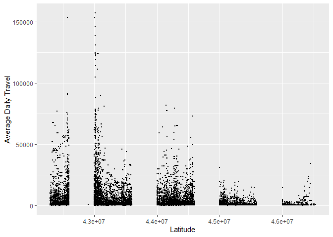

Bridges homework
================
Faith Kulzer
2/4/2021

``` r
library('readr')
library('data.table')
library('tidyverse')
bridges <- fread("https://www.fhwa.dot.gov/bridge/nbi/2019/delimited/WI19.txt")


##filter out useful columns, rename
bridges_filtered <- bridges %>%
  select(STRUCTURE_NUMBER_008, COUNTY_CODE_003, DECK_COND_058, SUPERSTRUCTURE_COND_059, SUBSTRUCTURE_COND_060, YEAR_BUILT_027, ADT_029, LAT_016, LONG_017) %>%
  rename(bridge_id = STRUCTURE_NUMBER_008, fip_code = COUNTY_CODE_003, deck_cond = DECK_COND_058, super_cond = SUPERSTRUCTURE_COND_059, sub_cond = SUBSTRUCTURE_COND_060, year = YEAR_BUILT_027, adt = ADT_029, latitude = LAT_016, longitude = LONG_017)

head(bridges_filtered)
```

    ##          bridge_id fip_code deck_cond super_cond sub_cond year adt latitude
    ## 1: 00000000000F303       51         4          5        5 1932  50 45585400
    ## 2: 00000000000F304       51         5          5        4 1974  20 46011583
    ## 3: 00000000000F310      115         5          5        7 1948 100 44542955
    ## 4: 00000000000F311      115         5          7        8 1979 150 44563600
    ## 5: 00000000000F315        3         5          5        7 1977 300 46360600
    ## 6: 00000000000F317        3         7          8        7 1980  20 46371020
    ##    longitude
    ## 1:  89560600
    ## 2:  89454321
    ## 3:  88544561
    ## 4:  88554200
    ## 5:  90390000
    ## 6:  90421190

``` r
ggplot(bridges_filtered, aes(x=latitude, y=adt)) +
  geom_point(size=0.4) +
  xlab("Latitude") +
  ylab("Average Daily Travel") 
```

<!-- -->

This graph shows the average daily travel for each bridge by the
latitude coordinate of the bridge. The visible ‘groups’ of the longitude
may be due to a precision that is too low.
